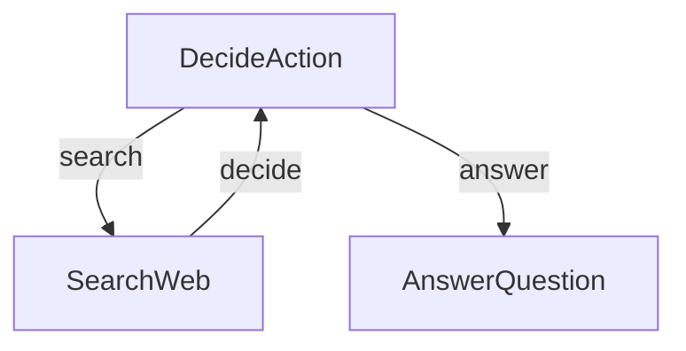

# PocketFlow Research Agent - Tutorial for Dummy

This project demonstrates a simple LLM-powered research agent built with PocketFlow, a minimalist LLM framework in 100 lines. For more information on PocketFlow and how to build LLM agents, check out:

- [LLM Agents are simply Graph — Tutorial For Dummies](https://zacharyhuang.substack.com/p/llm-agent-internal-as-a-graph-tutorial)
- [PocketFlow GitHub](https://github.com/the-pocket/PocketFlow)
- [PocketFlow Documentation](https://the-pocket.github.io/PocketFlow/)

## What It Does

This agent can:
1. Answer questions by searching for information when needed
2. Make decisions about when to search and when to answer
3. Generate helpful responses based on collected research

## Setting Up

### Prerequisites
- Python 3.8+
- OpenAI API key

### Installation

1. Install the required packages:
```bash
pip install -r requirements.txt
```

## Structure

- [`main.py`](./main.py): Entry point and user interface
- [`flow.py`](./flow.py): Creates and connects the agent flow
- [`nodes.py`](./nodes.py): Defines the decision and action nodes
- [`utils.py`](./utils.py): Contains utility functions for LLM calls and web searches

## Quick Start Guide

### Step 1: Set Up Your OpenAI API Key

First, you must provide your OpenAI API key:

```bash
export OPENAI_API_KEY="your-api-key-here"
```

### Step 2: Test Utilities

Verify that your API key is working by testing the utilities:

```bash
python utils.py
```

This will test both the LLM call functionality and the web search capability.

### Step 3: Run the Agent

Run the agent with the default question ("Who won the Nobel Prize in Physics 2024?"):

```bash
python main.py
```

### Step 4: Ask Custom Questions

To ask your own question, use the `--` prefix:

```bash
python main.py --"What is quantum computing?"
```

## How It Works

The agent is structured as a simple directed graph with three main nodes:



1. **DecideAction**: Determines whether to search for information or provide an answer
2. **SearchWeb**: Searches the web for information
3. **AnswerQuestion**: Creates a final answer once enough information is gathered
