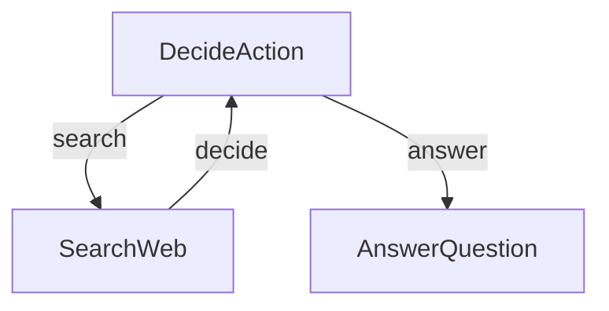

# PocketFlow Research Agent - Tutorial for Dummy

This project demonstrates a simple yet powerful LLM-powered research agent built with PocketFlow, a minimalist LLM framework in just 100 lines of code! 

> 📝 **Note:** This implementation is based directly on the tutorial post [LLM Agents are simply Graph — Tutorial For Dummies](https://zacharyhuang.substack.com/p/llm-agent-internal-as-a-graph-tutorial). Check it out for a better understanding of the concepts!

Want to learn more about PocketFlow and building cool LLM agents? Check out:
- [PocketFlow GitHub](https://github.com/the-pocket/PocketFlow)
- [PocketFlow Documentation](https://the-pocket.github.io/PocketFlow/)

## ✨ What Can This Agent Do?

This friendly little agent can:
1. 🔎 Search the web for information when it needs more context
2. 🧠 Decide intelligently when to search and when it has enough info to answer
3. 📝 Generate helpful, informative responses based on its research

## 🚀 Getting Started

### What You'll Need
- Python 3.8 or newer
- An OpenAI API key (don't worry, we'll help you set this up!)

### Easy Installation

1. Install the packages you need with this simple command:
```bash
pip install -r requirements.txt
```

## 📂 Project Structure

Here's what's in each file:
- [`main.py`](./main.py): The starting point - runs the whole show!
- [`flow.py`](./flow.py): Connects everything together into a smart agent
- [`nodes.py`](./nodes.py): The building blocks that make decisions and take actions
- [`utils.py`](./utils.py): Helper functions for talking to the LLM and searching the web

## 🏃‍♂️ Quick Start Guide

### Step 1: Set Up Your API Key

First, let's get your OpenAI API key ready:

```bash
export OPENAI_API_KEY="your-api-key-here"
```

### Step 2: Make Sure Everything Works

Let's do a quick check to make sure your API key is working properly:

```bash
python utils.py
```

This will test both the LLM call and web search features. If you see responses, you're good to go!

### Step 3: Run Your Agent

Try out the agent with the default question (about Nobel Prize winners):

```bash
python main.py
```

### Step 4: Ask Your Own Questions

Got a burning question? Ask anything you want by using the `--` prefix:

```bash
python main.py --"What is quantum computing?"
```

## 🧩 How It Works

The magic happens through a simple but powerful graph structure with three main parts:



Here's what each part does:
1. **DecideAction**: The brain that figures out whether to search or answer
2. **SearchWeb**: The researcher that goes out and finds information
3. **AnswerQuestion**: The writer that crafts the final answer