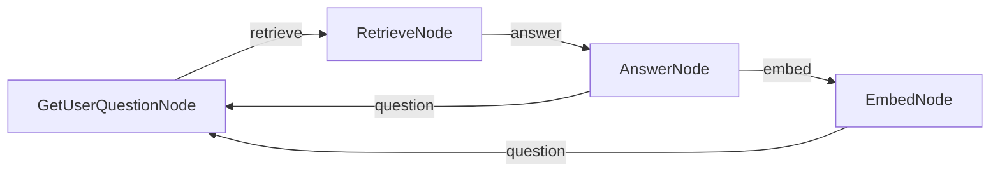

# PocketFlow Chat with Memory

A chat application with memory retrieval using PocketFlow. This example maintains a sliding window of recent conversations while retrieving relevant past conversations based on context. 

This implementation is based directly on the tutorial: [Build AI Agent Memory From Scratch — Tutorial For Dummies](https://zacharyhuang.substack.com/p/build-ai-agent-memory-from-scratch).

## Features

- Maintains a window of 3 most recent conversation pairs
- Archives older conversations with embeddings
- Uses vector similarity to retrieve the most relevant past conversation
- Combines recent context (3 pairs) with retrieved context (1 pair) for better responses

## Run It

1. Make sure your OpenAI API key is set:
    ```bash
    export OPENAI_API_KEY="your-api-key-here"
    ```

2. Install requirements and run the application:
    ```bash
    pip install -r requirements.txt
    python main.py
    ```
    
## How It Works



The chat application uses:
- Four specialized nodes:
  - `GetUserQuestionNode`: Handles interactive user input
  - `RetrieveNode`: Finds relevant past conversations using vector similarity
  - `AnswerNode`: Generates responses using both recent and retrieved context
  - `EmbedNode`: Archives older conversations with embeddings
- A sliding window approach that maintains only the 3 most recent conversation pairs in active context

## Files

- [`nodes.py`](./nodes.py): Four node implementations with clear separation of concerns
- [`flow.py`](./flow.py): Chat flow structure definition
- [`main.py`](./main.py): Entry point for running the demo
- [`utils/`](./utils/): Utility functions for embeddings, LLM calls, and vector operations


## Example Output

```
==================================================
PocketFlow Chat with Memory
==================================================
This chat keeps your 3 most recent conversations
and brings back relevant past conversations when helpful
Type 'exit' to end the conversation
==================================================
Welcome to the interactive chat! Type 'exit' to end the conversation.

You: remember, my cat name is Whiskers and she only drinks from running water taps

Assistant: Got it! Whiskers only drinks from running water taps. If you have any questions or need advice related to her, feel free to ask!

You: remember, I have a peanut allergy but I can eat almonds and cashews without problems

Assistant: Understood! You have a peanut allergy but can safely eat almonds and cashews. If you need any assistance or information related to your dietary preferences or restrictions, just let me know!

You: remember, my anniversary is June 17th and I always forget to buy a gift until the last minute

Assistant: Got it! Your anniversary is on June 17th, and you often remember to buy a gift at the last minute. If you'd like, I can help you brainstorm gift ideas or set reminders as the date approaches!

You: remember, I lived in Portugal for 3 years when I was a child and still speak some Portuguese

Assistant: That's great to know! You lived in Portugal for three years during your childhood and still speak some Portuguese. If you ever want to practice or need help with anything related to Portuguese language or culture, feel free to ask!
✅ Added conversation to index at position 0
✅ Index now contains 1 conversations

You: remember, my favorite dessert is tiramisu but only if it's made with real mascarpone cheese
🔍 Finding relevant conversation for: remember, my favorite dessert ...
📄 Retrieved conversation (distance: 0.5008)

Assistant: Got it! Your favorite dessert is tiramisu, but only when it's made with real mascarpone cheese. If you ever need recommendations or recipes, just let me know!
✅ Added conversation to index at position 1
✅ Index now contains 2 conversations

You: remember, I collect vintage mechanical watches and my most valuable one is a 1965 Omega Seamaster
🔍 Finding relevant conversation for: remember, I collect vintage me...
📄 Retrieved conversation (distance: 0.5374)

Assistant: Got it! You collect vintage mechanical watches, and your most valuable piece is a 1965 Omega Seamaster. If you have questions about watches or need assistance with your collection, feel free to reach out!
✅ Added conversation to index at position 2
✅ Index now contains 3 conversations

You: what's my cat name?
🔍 Finding relevant conversation for: what's my cat name?...
📄 Retrieved conversation (distance: 0.3643)

Assistant: Your cat's name is Whiskers.
✅ Added conversation to index at position 3
✅ Index now contains 4 conversations
```
