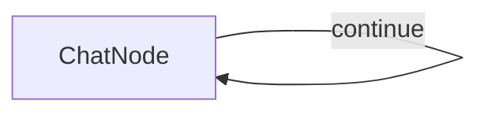

#  Simple PocketFlow Chat

A basic chat application using PocketFlow with OpenAI's GPT-4o model.

## Features

- Conversational chat interface in the terminal
- Maintains full conversation history for context
- Simple implementation demonstrating PocketFlow's node and flow concepts

## Run It

1. Make sure your OpenAI API key is set:
    ```bash
    export OPENAI_API_KEY="your-api-key-here"
    ```
    Alternatively, you can edit the `utils.py` file to include your API key directly.

2. Install requirements and run the application:
    ```bash
    pip install -r requirements.txt
    python main.py
    ```

## How It Works



The chat application uses:
- A single `ChatNode` with a self-loop that:
  - Takes user input in the `prep` method
  - Sends the complete conversation history to GPT-4o
  - Adds responses to the conversation history
  - Loops back to continue the chat until the user types 'exit'


## Files

- [`main.py`](./main.py): Implementation of the ChatNode and chat flow
- [`utils.py`](./utils.py): Simple wrapper for calling the OpenAI API
 