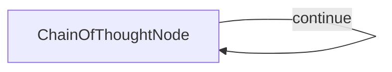

# Extended Thinking

This project demonstrates an extended thinking mode implementation that enables LLMs to solve complex reasoning problems by thinking step-by-step. It's designed to improve problem-solving accuracy through deliberate reasoning.

## Features

- Improves model reasoning on complex problems
- Works with models like Claude 3.7 Sonnet that support extended thinking
- Solves problems that direct prompting often fails on
- Provides detailed reasoning traces for verification

## Getting Started

1. Install the required packages:
```bash
pip install -r requirements.txt
```

2. Set up your API key:
```bash
export ANTHROPIC_API_KEY="your-api-key-here"
```

3. Run a test problem to see thinking mode in action:
```bash
python main.py
```

4. Try your own reasoning problem:
```bash
python main.py --"Your complex reasoning problem here"
```

## How It Works

The implementation uses a self-looping Chain of Thought node that allows an LLM to think through complex problems step by step:



Each time the node loops, it:
1. Reads the problem and previous thoughts
2. Generates the next thought or final solution
3. Decides whether more thinking is needed

This approach helps LLMs solve problems that would be difficult with a single-pass approach.


## Example Thinking Process

Example Problem from [Quant Interview](https://www.youtube.com/watch?v=SCP7JptxPU0):

```
You work at a shoe factory. In front of you, there are three pairs of shoes (six individual shoes) with the following sizes: two size 4s, two size 5s, and two size 6s. The factory defines an "acceptable pair" as two shoes that differ in size by a maximum of one size (e.g., a size 5 and a size 6 would be an acceptable pair). If you close your eyes and randomly pick three pairs of shoes without replacement, what is the probability that you end up drawing three acceptable pairs?
```

Below is an example of how Claude 3.7 Sonnet  to solve this complex problem, and get the correct result:

```
========================
All structured answers: ['0.333', '0.333', '0.333', '0.6', '0.333']
Majority vote => 0.333
Frequency => 4
========================

=== Final Answer ===
0.333
====================
```

## Files

- [`main.py`](./main.py): Implementation of the ...
- [`utils.py`](./utils.py): Simple wrapper for calling the Anthropic model
 