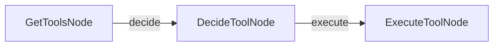

# PocketFlow MCP Demo

This project shows how to build an agent that performs addition using PocketFlow and Model Context Protocol (MCP). It presents a comparison between using MCP and basic function calling approaches.

## Features

- Addition operations through a simple terminal interface
- Integration with Model Context Protocol (MCP)
- Comparison between MCP and direct function calling

## How to Run

1. Set your API key:
   ```bash
   export OPENAI_API_KEY="your-api-key-here"
   ```
   Or update it directly in `utils.py`

2. Install and run:
   ```bash
   pip install -r requirements.txt
   python main.py
   ```

## MCP vs Function Calling

To compare both approaches, this demo provides local function alternatives that don't require MCP:

- To use traditional function calling instead of MCP, replace:
  - `get_tools()` with `local_get_tools()`
  - `call_tool()` with `local_call_tool()`

This allows you to see the difference between the two approaches while keeping the same workflow.

### Function Calling
- Functions are directly embedded in application code
- Each new tool requires modifying the application
- Tools are defined within the application itself

### MCP Approach
- Tools live in separate MCP servers
- Standard protocol for all tool interactions
- New tools can be added without changing the agent
- AI can interact with tools through a consistent interface

## How It Works



The agent uses PocketFlow to create a workflow where:
1. It takes user input about numbers
2. Connects to the MCP server for addition operations
3. Returns the result

## Files

- [`main.py`](./main.py): Implementation of the addition agent using PocketFlow
- [`utils.py`](./utils.py): Helper functions for API calls and MCP integration
- [`simple_server.py`](./simple_server.py): MCP server that provides the addition tool