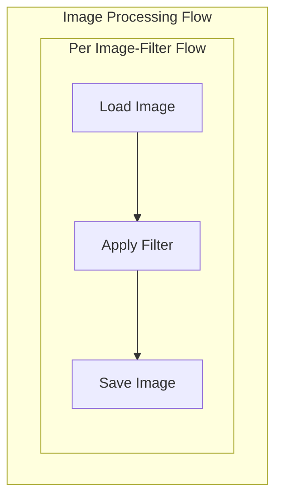

# Parallel Image Processor (AsyncParallelBatchFlow Example)

This example demonstrates how to use `AsyncParallelBatchFlow` to process multiple images with multiple filters in parallel.

## How it Works

1. **Image Generation**: Creates sample images (gradient, checkerboard, circles)
2. **Filter Application**: Applies different filters (grayscale, blur, sepia) to each image
3. **Parallel Processing**: Processes all image-filter combinations concurrently

### Flow Structure



### Key Components

1. **LoadImage (AsyncNode)**
   - Loads an image from file
   - Uses PIL for image handling

2. **ApplyFilter (AsyncNode)**
   - Applies the specified filter
   - Supports grayscale, blur, and sepia

3. **SaveImage (AsyncNode)**
   - Saves the processed image
   - Creates output directory if needed

4. **ImageBatchFlow (AsyncParallelBatchFlow)**
   - Manages parallel processing of all image-filter combinations
   - Returns parameters for each sub-flow

## Running the Example

1. Install dependencies:
```bash
pip install -r requirements.txt
```

2. Run the example:
```bash
python main.py
```

## Sample Output

The example will:
1. Create 3 sample images: `cat.jpg`, `dog.jpg`, `bird.jpg`
2. Apply 3 filters to each image
3. Save results in `output/` directory (9 total images)

Example output structure:
```
output/
├── cat_grayscale.jpg
├── cat_blur.jpg
├── cat_sepia.jpg
├── dog_grayscale.jpg
...etc
```

## Key Concepts

1. **Parallel Flow Execution**: Each image-filter combination runs as a separate flow in parallel
2. **Parameter Management**: The batch flow generates parameters for each sub-flow
3. **Resource Management**: Uses semaphores to limit concurrent image processing
4. **Error Handling**: Gracefully handles failures in individual flows 