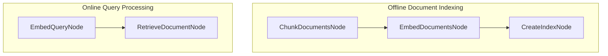

# Retrieval Augmented Generation (RAG)

This project demonstrates a simplified RAG system that retrieves relevant documents based on user queries.

## Features

- Document chunking for better retrieval granularity
- Simple vector-based document retrieval
- Two-stage pipeline (offline indexing, online querying)
- FAISS-powered similarity search

## Getting Started

1. Install the required dependencies:

```bash
pip install -r requirements.txt
```

2. Run the application with a sample query:

```bash
python main.py --"Large Language Model"
```

3. Or run without arguments to use the default query:

```bash
python main.py
```

## API Key

By default, demo uses dummy embedding based on character frequencies. To use real OpenAI embedding:

1. Edit nodes.py to replace the dummy `get_embedding` with `get_openai_embedding`:
```python
# Change this line:
query_embedding = get_embedding(query)
# To this:
query_embedding = get_openai_embedding(query)

# And also change this line:
return get_embedding(text)
# To this:
return get_openai_embedding(text)
```

2. Make sure your OpenAI API key is set:
```bash
export OPENAI_API_KEY="your-api-key-here"
```

## How It Works

The magic happens through a two-stage pipeline implemented with PocketFlow:



Here's what each part does:
1. **ChunkDocumentsNode**: Splits documents into smaller chunks for more granular retrieval
2. **EmbedDocumentsNode**: Converts document chunks into vector representations
3. **CreateIndexNode**: Creates a searchable FAISS index from embeddings
4. **EmbedQueryNode**: Converts user query into the same vector space
5. **RetrieveDocumentNode**: Finds the most similar document chunk using vector search

## Example Output

```
==================================================
PocketFlow RAG Document Retrieval
==================================================
✅ Created 5 chunks from 5 documents
✅ Created 5 document embeddings
🔍 Creating search index...
✅ Index created with 5 vectors
🔍 Embedding query: Large Language Model
🔎 Searching for relevant documents...
📄 Retrieved document (index: 3, distance: 0.3296)
📄 Most relevant text: "PocketFlow is a 100-line Large Language Model Framework."
```

## Files

- [`main.py`](./main.py): Main entry point for running the RAG demonstration
- [`flow.py`](./flow.py): Configures the flows that connect the nodes
- [`nodes.py`](./nodes.py): Defines the nodes for document processing and retrieval
- [`utils.py`](./utils.py): Utility functions including chunking and embedding functions