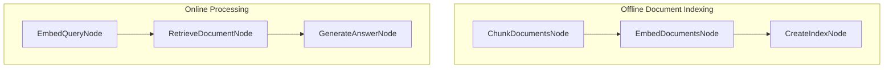

# Retrieval Augmented Generation (RAG)

This project demonstrates a simplified RAG system that retrieves relevant documents based on user queries and generates answers using an LLM. This implementation is based directly on the tutorial: [Retrieval Augmented Generation (RAG) from Scratch — Tutorial For Dummies](https://zacharyhuang.substack.com/p/retrieval-augmented-generation-rag).


## Features

- Document chunking for processing long texts
- FAISS-powered vector-based document retrieval
- LLM-powered answer generation

## How to Run

1. Set your API key:
   ```bash
   export OPENAI_API_KEY="your-api-key-here"
   ```
   Or update it directly in `utils.py`

2. Install and run with the default query:
   ```bash
   pip install -r requirements.txt
   python main.py
   ```

3. Run the application with a sample query:

   ```bash
   python main.py --"How does the Q-Mesh protocol achieve high transaction speeds?"
   ```

## How It Works

The magic happens through a two-phase pipeline implemented with PocketFlow:



Here's what each part does:
1. **ChunkDocumentsNode**: Breaks documents into smaller chunks for better retrieval
2. **EmbedDocumentsNode**: Converts document chunks into vector representations
3. **CreateIndexNode**: Creates a searchable FAISS index from embeddings
4. **EmbedQueryNode**: Converts user query into the same vector space
5. **RetrieveDocumentNode**: Finds the most similar document using vector search
6. **GenerateAnswerNode**: Uses an LLM to generate an answer based on the retrieved content

## Example Output

```
✅ Created 5 chunks from 5 documents
✅ Created 5 document embeddings
🔍 Creating search index...
✅ Index created with 5 vectors
🔍 Embedding query: How to install PocketFlow?
🔎 Searching for relevant documents...
📄 Retrieved document (index: 0, distance: 0.3427)
📄 Most relevant text: "Pocket Flow is a 100-line minimalist LLM framework
        Lightweight: Just 100 lines. Zero bloat, zero dependencies, zero vendor lock-in.
        Expressive: Everything you love—(Multi-)Agents, Workflow, RAG, and more.
        Agentic Coding: Let AI Agents (e.g., Cursor AI) build Agents—10x productivity boost!
        To install, pip install pocketflow or just copy the source code (only 100 lines)."

🤖 Generated Answer:
To install PocketFlow, use the command `pip install pocketflow` or simply copy its 100 lines of source code.
```
