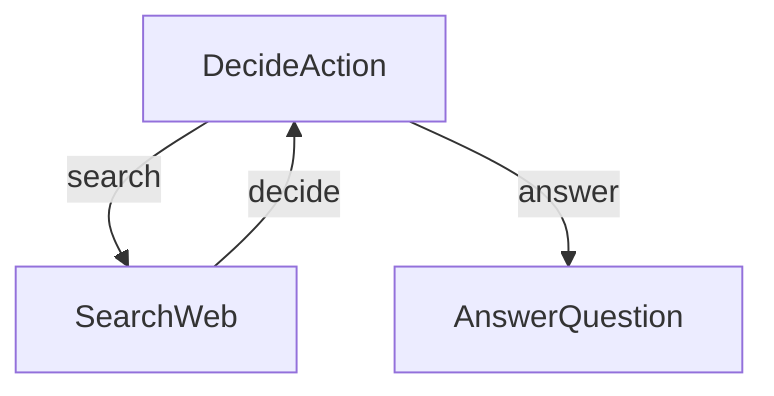

# Research Agent

This project demonstrates a simple yet powerful LLM-powered research agent. This implementation is based directly on the tutorial: [LLM Agents are simply Graph — Tutorial For Dummies](https://zacharyhuang.substack.com/p/llm-agent-internal-as-a-graph-tutorial).

👉 Run the tutorial in your browser: [Try Google Colab Notebook](
https://colab.research.google.com/github/The-Pocket/PocketFlow/blob/main/cookbook/pocketflow-agent/demo.ipynb)

## Features

- Performs web searches to gather information
- Makes decisions about when to search vs. when to answer
- Generates comprehensive answers based on research findings

## Getting Started

1. Install the packages you need with this simple command:
```bash
pip install -r requirements.txt
```

2. Let's get your OpenAI API key ready:

```bash
export OPENAI_API_KEY="your-api-key-here"
```

3. Let's do a quick check to make sure your API key is working properly:

```bash
python utils.py
```

This will test both the LLM call and web search features. If you see responses, you're good to go!

4. Try out the agent with the default question (about Nobel Prize winners):

```bash
python main.py
```

5. Got a burning question? Ask anything you want by using the `--` prefix:

```bash
python main.py --"What is quantum computing?"
```

## How It Works?

The magic happens through a simple but powerful graph structure with three main parts:



Here's what each part does:
1. **DecideAction**: The brain that figures out whether to search or answer
2. **SearchWeb**: The researcher that goes out and finds information
3. **AnswerQuestion**: The writer that crafts the final answer

Here's what's in each file:
- [`main.py`](./main.py): The starting point - runs the whole show!
- [`flow.py`](./flow.py): Connects everything together into a smart agent
- [`nodes.py`](./nodes.py): The building blocks that make decisions and take actions
- [`utils.py`](./utils.py): Helper functions for talking to the LLM and searching the web
