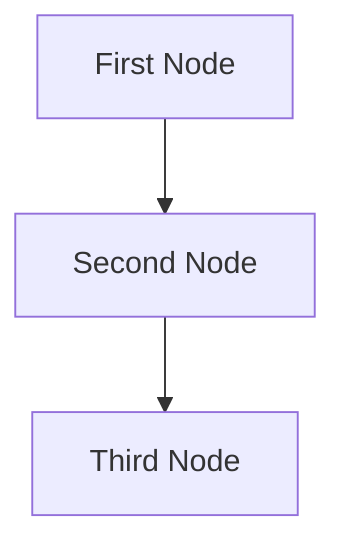

# Your Project Title

## Project Requirements
A description of the project requirements. 

## Utility Functions

1. **Call LLM** (`utils/call_llm.py`)

## Flow Design

1. **First Node**
2. **Second Node**
3. **Third Node**

### Flow Diagram



## Data Structure

The shared memory structure will be organized as follows:

```python
shared = {
    "key": "value"
}
```

## Node Designs

### 1. First Node
- **Purpose**: What the node does
- **Design**: Regular Node (no Batch/Async)
- **Data Access**: 
  - Read: "key" from shared store
  - Write: "key" to shared store

### 2. Second Node
...

### 3. Third Node
