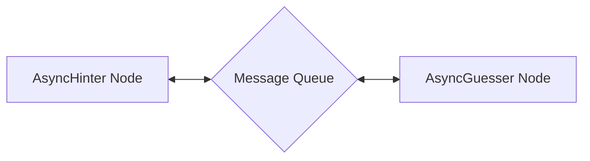

# Multi-Agent Taboo Game

A PocketFlow example that demonstrates how to implement asynchronous multi-agent communication using the Taboo word guessing game.

## Features

- Implement asynchronous communication between two AI agents (Hinter and Guesser)
- Use AsyncNode for non-blocking agent interactions
- Create dynamic conversation flow through asyncio message queues
- Demonstrate complex turn-based game mechanics with LLMs
- Automatically terminate the game when the correct word is guessed

## Getting Started

1. Install the required dependencies:

```bash
pip install -r requirements.txt
```

2. Set your OpenAI API key as an environment variable:

```bash
export OPENAI_API_KEY=your_api_key_here
```

3. Run the application:

```bash
python main.py
```

## How It Works

The workflow follows an asynchronous multi-agent communication pattern:



Here's what each component does:

1. **AsyncHinter Node**: Generates hints about the target word while avoiding forbidden words
2. **AsyncGuesser Node**: Makes guesses based on the hints received from the Hinter
3. **Message Queue**: Facilitates asynchronous communication between the agents

## Files

- [`main.py`](./main.py): Main entry point implementing the AsyncHinter and AsyncGuesser nodes and game flow
- [`utils.py`](./utils.py): Utility functions including LLM wrappers for generating hints and guesses
- [`requirements.txt`](./requirements.txt): Lists the required dependencies

## Example Output

```
=========== Taboo Game Starting! ===========
Target word: nostalgic
Forbidden words: ['memory', 'past', 'remember', 'feeling', 'longing']
============================================

Hinter: Here's your hint - Sentiment for earlier times.
Guesser: I guess it's - Nostalgia

Hinter: Here's your hint - Sentiment for earlier times.
Guesser: I guess it's - Reminiscence

Hinter: Here's your hint - Yearning for days gone by.
Guesser: I guess it's - Sentimentality

Hinter: Here's your hint - Reliving cherished moments or experiences.
Guesser: I guess it's - Memories

Hinter: Here's your hint - Recollection of cherished experiences.
Guesser: I guess it's - Reflection

Hinter: Here's your hint - Yearning for earlier times.
Guesser: I guess it's - Longing

Hinter: Here's your hint - Sentiment for earlier times.
Guesser: I guess it's - Nostalgic
Game Over - Correct guess!