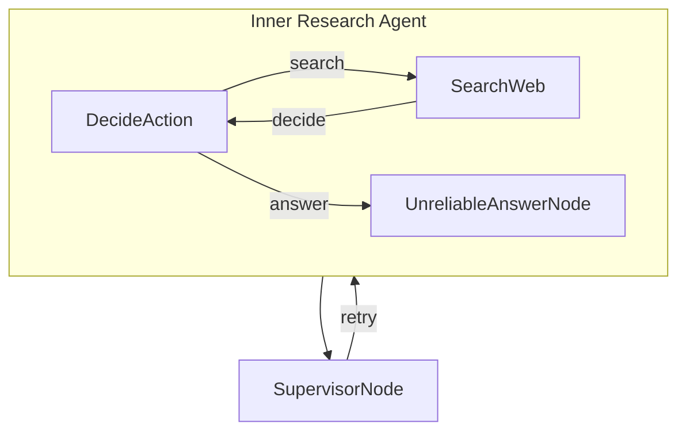

# Research Supervisor

This project demonstrates a supervisor that oversees an unreliable [research agent](../pocketflow-agent) to ensure high-quality answers.

## Features

- Evaluates responses for quality and relevance
- Rejects nonsensical or unreliable answers
- Requests new answers until a quality response is produced

## Getting Started

1. Install the packages you need with this simple command:
```bash
pip install -r requirements.txt
```

2. Let's get your OpenAI API key ready:

```bash
export OPENAI_API_KEY="your-api-key-here"
```

3. Let's do a quick check to make sure your API key is working properly:

```bash
python utils.py
```

This will test both the LLM call and web search features. If you see responses, you're good to go!

4. Try out the agent with the default question (about Nobel Prize winners):

```bash
python main.py
```

5. Got a burning question? Ask anything you want by using the `--` prefix:

```bash
python main.py --"What is quantum computing?"
```

## How It Works?

The magic happens through a simple but powerful graph structure with these main components:



Here's what each part does:
1. **DecideAction**: The brain that figures out whether to search or answer based on current context
2. **SearchWeb**: The researcher that goes out and finds information using web search
3. **UnreliableAnswerNode**: Generates answers (with a 50% chance of being unreliable)
4. **SupervisorNode**: Quality control that validates answers and rejects nonsensical ones

## Example Output

```
🤔 Processing question: Who won the Nobel Prize in Physics 2024?
🤔 Agent deciding what to do next...
🔍 Agent decided to search for: Nobel Prize in Physics 2024 winner
🌐 Searching the web for: Nobel Prize in Physics 2024 winner
📚 Found information, analyzing results...
🤔 Agent deciding what to do next...
💡 Agent decided to answer the question
🤪 Generating unreliable dummy answer...
✅ Answer generated successfully
    🔍 Supervisor checking answer quality...
    ❌ Supervisor rejected answer: Answer appears to be nonsensical or unhelpful
🤔 Agent deciding what to do next...
💡 Agent decided to answer the question
✍️ Crafting final answer...
✅ Answer generated successfully
    🔍 Supervisor checking answer quality...
    ✅ Supervisor approved answer: Answer appears to be legitimate

🎯 Final Answer:
The Nobel Prize in Physics for 2024 was awarded jointly to John J. Hopfield and Geoffrey Hinton. They were recognized "for foundational discoveries and inventions that enable machine learning with artificial neural networks." Their work has been pivotal in the field of artificial intelligence, specifically in developing the theories and technologies that support machine learning using artificial neural networks. John Hopfield is associated with Princeton University, while Geoffrey Hinton is connected to the University of Toronto. Their achievements have laid essential groundwork for advancements in AI and its widespread application across various domains.
```

## Files

- [`main.py`](./main.py): The starting point - runs the whole show!
- [`flow.py`](./flow.py): Connects everything together into a smart agent with supervision
- [`nodes.py`](./nodes.py): The building blocks that make decisions, take actions, and validate answers
- [`utils.py`](./utils.py): Helper functions for talking to the LLM and searching the web
