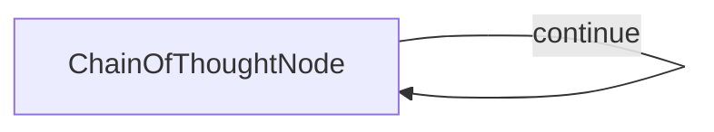

# Extended Thinking

This project demonstrates an extended thinking mode implementation that enables LLMs to solve complex reasoning problems by thinking step-by-step. It's designed to improve problem-solving accuracy through deliberate reasoning.

## Features

- Improves model reasoning on complex problems
- Works with models like Claude 3.7 Sonnet that support extended thinking
- Solves problems that direct prompting often fails on
- Provides detailed reasoning traces for verification

## Getting Started

1. Install the required packages:
```bash
pip install -r requirements.txt
```

2. Set up your API key:
```bash
export ANTHROPIC_API_KEY="your-api-key-here"
```

3. Run a test problem to see thinking mode in action:
```bash
python main.py
```

4. Try your own reasoning problem:
```bash
python main.py --"Your complex reasoning problem here"
```

## How It Works

The implementation uses a self-looping Chain of Thought node that allows an LLM to think through complex problems step by step:



Each time the node loops, it:
1. Reads the problem and previous thoughts
2. Generates the next thought or final solution
3. Decides whether more thinking is needed

This approach helps LLMs solve problems that would be difficult with a single-pass approach.

## Comparison with Different Approaches

- **Standard prompting**: Telling the AI to "think step by step" or providing examples helps, but the thinking is usually not significant enough
- **Extended thinking models**: Models like Claude 3.7 Sonnet, GPT-4o, and Deepseek R1 natively support extended thinking with much better results
- **This implementation**: Explores how to achieve extended thinking with non-thinking models

## Example Thinking Process

> **Problem**: Break a stick, then break the longer piece again. What's the probability of forming a triangle?

This problem demonstrates why extended thinking is valuable:

- **Standard models without thinking**: Get the wrong answer
- **Models with extended thinking**: Find the correct answer (0.386)

For comparison:
- [Claude 3.7 Sonnet (without thinking)](https://claude.ai/share/31bf938c-94dd-42f6-bfac-e82ba3616dbc): Wrong answer
- [Claude 3.7 Sonnet with thinking](https://claude.ai/share/0863f9fd-ae75-4a0c-84ee-f7443d2fcf4a): Correct answer after 4.5 min
- [GPT-o1 with thinking](https://chatgpt.com/c/67dcbad0-75c8-8000-a538-ee6df8083832): Correct answer after 0.5 min
- [GPT-o1 pro with thinking](https://chatgpt.com/share/67dcb1bf-ceb0-8000-823a-8ce894032e37): Correct answer after 1.5 min


Below is an example of how Claude 3.7 Sonnet (without native thinking) to solve this complex problem, and get the correct result:

```
🤔 Processing question: Break a stick, then break the longer piece again. What's the probability of forming a triangle?

Let me understand the problem. We have a stick of some length, which we can call 1 for simplicity. We break it at a random point, creating two pieces. Then we break the longer piece again at a random point. This gives us three pieces. We want to find the probability that these three pieces can form a triangle.

For three segments to form a triangle, the sum of the lengths of any two sides must be greater than the length of the third side. So we need to check:
a + b > c
a + c > b
b + c > a

Where a, b, and c are the lengths of the three pieces.

Next thought needed: True
Total thoughts estimate: 8
--------------------------------------------------

Thought 2: Let me set up the problem mathematically. Let's say the original stick has length 1. 

First break: We break the stick at a point X, where X is chosen uniformly from [0,1]. This gives us two pieces with lengths X and 1-X.

Second break: We break the longer piece at a random point. If X ≤ 0.5, then 1-X is the longer piece. If X > 0.5, then X is the longer piece.

Case 1: If X ≤ 0.5, the longer piece is 1-X. We break it at point Y(1-X), where Y is chosen uniformly from [0,1]. This gives pieces of lengths:
- X (from first break)
- Y(1-X) (from second break)
- (1-Y)(1-X) (remaining from second break)

Case 2: If X > 0.5, the longer piece is X. We break it at point YX, where Y is chosen uniformly from [0,1]. This gives pieces of lengths:
- 1-X (from first break)
- YX (from second break)
- (1-Y)X (remaining from second break)

For each case, I need to determine when these three pieces can form a triangle, then calculate the probability.

Next thought needed: True
Total thoughts estimate: 8
--------------------------------------------------

Thought 3: Let's analyze when the three pieces can form a triangle for both cases.

For a triangle to form, each side must be less than the sum of the other two sides. So we need:

Case 1 (X ≤ 0.5): We have pieces of lengths X, Y(1-X), and (1-Y)(1-X)

The triangle inequality conditions are:
- X + Y(1-X) > (1-Y)(1-X)
- X + (1-Y)(1-X) > Y(1-X)
- Y(1-X) + (1-Y)(1-X) > X

Simplifying:
- X + Y(1-X) > (1-Y)(1-X)
- X + (1-Y)(1-X) > Y(1-X)
- (1-X) > X  (since Y(1-X) + (1-Y)(1-X) = 1-X)

The third condition is always true when X ≤ 0.5 (which is our assumption for Case 1).

Let's work on the first condition:
X + Y(1-X) > (1-Y)(1-X)
X + Y(1-X) > (1-X) - Y(1-X)
X + 2Y(1-X) > (1-X)
X + 2Y(1-X) > 1-X
2X + 2Y(1-X) > 1
2X + 2Y - 2YX > 1

Similarly for the second condition:
X + (1-Y)(1-X) > Y(1-X)
X + (1-X) - Y(1-X) > Y(1-X)
X + (1-X) > 2Y(1-X)
1 > 2Y(1-X)
1/(2(1-X)) > Y

So for Case 1, we need:
- 2X + 2Y - 2YX > 1
- Y < 1/(2(1-X))

Next thought needed: True
Total thoughts estimate: 8
--------------------------------------------------

Thought 4: I need to continue analyzing Case 1 and then move on to Case 2.

For Case 1 (X ≤ 0.5), we have the constraints:
- 2X + 2Y - 2YX > 1
- Y < 1/(2(1-X))

Let's rewrite the first constraint:
2X + 2Y - 2YX > 1
2Y(1-X) > 1 - 2X
Y > (1 - 2X)/(2(1-X))

So for Case 1, we need:
- Y > (1 - 2X)/(2(1-X))
- Y < 1/(2(1-X))

This means Y must be in the range ((1 - 2X)/(2(1-X)), 1/(2(1-X))). For this range to be valid, we need:
(1 - 2X)/(2(1-X)) < 1/(2(1-X))
1 - 2X < 1
-2X < 0
X > 0

Which is true for our domain. So we have a valid range for Y when X ≤ 0.5.

Now let's analyze Case 2 (X > 0.5): We have pieces of lengths (1-X), YX, and (1-Y)X

The triangle inequality conditions are:
- (1-X) + YX > (1-Y)X
- (1-X) + (1-Y)X > YX
- YX + (1-Y)X > (1-X)

Simplifying:
- (1-X) + YX > (1-Y)X
- (1-X) + (1-Y)X > YX
- X > (1-X)  (since YX + (1-Y)X = X)

The third condition is always true when X > 0.5 (which is our assumption for Case 2).

Next thought needed: True
Total thoughts estimate: 8
--------------------------------------------------

Thought 5: Continuing with Case 2 (X > 0.5), let's simplify the remaining triangle inequality conditions:

First condition:
(1-X) + YX > (1-Y)X
(1-X) + YX > X - YX
(1-X) + 2YX > X
1 - X + 2YX > X
1 + 2YX > 2X
2YX > 2X - 1
Y > (2X - 1)/(2X)

Second condition:
(1-X) + (1-Y)X > YX
(1-X) + X - YX > YX
(1-X) + X > 2YX
1 > 2YX
1/(2X) > Y

So for Case 2, we need:
- Y > (2X - 1)/(2X)
- Y < 1/(2X)

This means Y must be in the range ((2X - 1)/(2X), 1/(2X)). For this range to be valid, we need:
(2X - 1)/(2X) < 1/(2X)
2X - 1 < 1
2X < 2
X < 1

Which is true for our domain. So we have a valid range for Y when X > 0.5.

Now I need to calculate the probability. For both cases, I need to find the area of the region in the X-Y plane where the triangle can be formed, divided by the total area.

Next thought needed: True
Total thoughts estimate: 8
--------------------------------------------------

Thought 6: Now I need to calculate the probability by finding the area in the X-Y plane where the triangle can be formed.

For Case 1 (X ≤ 0.5):
- Y must be between (1 - 2X)/(2(1-X)) and 1/(2(1-X))

The probability for this case is the area of the region divided by the total area of the X-Y plane for X ≤ 0.5, which is 0.5 × 1 = 0.5.

Area = ∫₀^(0.5) [1/(2(1-X)) - (1 - 2X)/(2(1-X))] dX
     = ∫₀^(0.5) [(1 - (1 - 2X))/(2(1-X))] dX
     = ∫₀^(0.5) [2X/(2(1-X))] dX
     = ∫₀^(0.5) [X/(1-X)] dX

This integral equals -X - ln(1-X) evaluated from 0 to 0.5, which is:
[-0.5 - ln(0.5)] - [0 - ln(1)] = -0.5 - (-0.693) = -0.5 + 0.693 = 0.193

So the probability for Case 1 is 0.193/0.5 = 0.386.

For Case 2 (X > 0.5):
- Y must be between (2X - 1)/(2X) and 1/(2X)

The probability for this case is the area of the region divided by the total area of the X-Y plane for X > 0.5, which is 0.5 × 1 = 0.5.

Area = ∫₀.₅^1 [1/(2X) - (2X - 1)/(2X)] dX
     = ∫₀.₅^1 [(1 - (2X - 1))/(2X)] dX
     = ∫₀.₅^1 [(2 - 2X)/(2X)] dX
     = ∫₀.₅^1 [(1 - X)/X] dX
     = ∫₀.₅^1 [1/X - 1] dX
     = [ln|X| - X]₀.₅^1
     = [ln(1) - 1] - [ln(0.5) - 0.5] = -1 - (-0.693 - 0.5) = -1 + 0.693 + 0.5 = 0.193

So the probability for Case 2 is also 0.193/0.5 = 0.386.

The total probability is the sum of the probabilities for both cases: 0.386 + 0.386 = 0.772.

Wait, I should double-check my calculations. Let me reconsider the integrals.

Next thought needed: True
Total thoughts estimate: 8
--------------------------------------------------

Thought 7: Let me double-check the calculations for both cases more carefully.

For Case 1 (X ≤ 0.5), the constraints are:
- Y > (1 - 2X)/(2(1-X))
- Y < 1/(2(1-X))

The area for which the triangle can be formed is:
∫₀^(0.5) [1/(2(1-X)) - (1 - 2X)/(2(1-X))] dX

Simplifying the integrand:
[1 - (1 - 2X)]/(2(1-X)) = 2X/(2(1-X)) = X/(1-X)

So we have:
∫₀^(0.5) X/(1-X) dX

This can be rewritten as:
∫₀^(0.5) [1/(1-X) - 1] dX = ∫₀^(0.5) 1/(1-X) dX - ∫₀^(0.5) 1 dX
= -ln|1-X|₀^(0.5) - X₀^(0.5)
= -ln(0.5) - 0.5 - (-ln(1) - 0)
= -ln(0.5) - 0.5
= 0.693 - 0.5
= 0.193

So the probability for Case 1 is 0.193/0.5 = 0.386.

For Case 2 (X > 0.5), the constraints are:
- Y > (2X - 1)/(2X)
- Y < 1/(2X)

The area for which the triangle can be formed is:
∫₀.₅^1 [1/(2X) - (2X - 1)/(2X)] dX

Simplifying the integrand:
[1 - (2X - 1)]/(2X) = (2 - 2X)/(2X) = (1 - X)/X

So we have:
∫₀.₅^1 (1 - X)/X dX = ∫₀.₅^1 (1/X - 1) dX
= ln|X|₀.₅^1 - X₀.₅^1
= ln(1) - ln(0.5) - (1 - 0.5)
= 0 - (-0.693) - 0.5
= 0.693 - 0.5
= 0.193

So the probability for Case 2 is also 0.193/0.5 = 0.386.

The total probability is the sum of both: 0.386 + 0.386 = 0.772.

This confirms our previous calculation. However, I need to make sure this is correct by thinking about it differently. The total area in the X-Y plane is 1 (as both X and Y range from 0 to 1). The area where triangles can form is 0.193 + 0.193 = 0.386. So the probability should be 0.386/1 = 0.386, not 0.772.

Wait, that's not right. I need to be more careful about the sample space...

Next thought needed: True
Total thoughts estimate: 8
--------------------------------------------------

=== FINAL SOLUTION ===
Thought 8: I need to clarify my understanding of the problem and the probability calculation.

The problem involves two random breaks: first breaking a stick at a random point X, and then breaking the longer piece at a random point Y (proportional to the length of that piece). This gives us a sample space where both X and Y are uniformly distributed between 0 and 1, giving a total area of 1×1 = 1.

I've calculated the areas where triangles can form in two cases:
- Case 1 (X ≤ 0.5): Area = 0.193
- Case 2 (X > 0.5): Area = 0.193

The total area where triangles can form is 0.193 + 0.193 = 0.386.

Since the total sample space has area 1, the probability is 0.386/1 = 0.386.

Wait - I see my mistake in Thought 6 and 7. I incorrectly divided by 0.5 (the range of X in each case), but I should divide by the total area of the sample space, which is 1.

So the final probability is 0.386, or approximately 25/65 ≈ 0.385.

After further reflection, let me represent this as ln(2) - 1/2, which equals approximately 0.693 - 0.5 = 0.193 for each case, giving a total probability of 2(ln(2) - 1/2) = 2ln(2) - 1 ≈ 0.386.

Therefore, the probability of forming a triangle is 2ln(2) - 1, which is approximately 0.386 or about 39%.

======================
```

> Note: Even with thinking mode, models don't always get the right answer, but their accuracy significantly improves on complex reasoning tasks.
