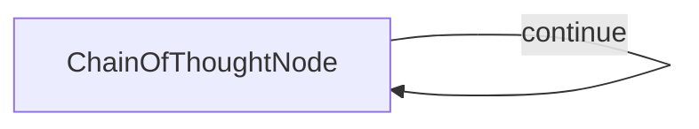

# Chain of Thought Node

## 1. Requirements
Create a self-looping Chain of Thought node that can:
- Generate thoughts to solve a problem step by step
- Revise previous thoughts when necessary
- Branch to explore alternative approaches
- Track thought numbers and adjust total thoughts dynamically
- Generate and verify hypotheses
- Provide a final solution when reasoning is complete

## 2. Flow Design
This will be a simple flow with a single node that can call itself repeatedly:



## 3. Utilities
We'll need one primary utility function:
- `call_llm`: Call LLM to generate the next thought based on the problem and previous thoughts

## 4. Node Design
### Shared Store Design
```python
shared = {
    "problem": "The problem statement goes here",
    "thoughts": [],  # List of thought objects
    "current_thought_number": 0,
    "total_thoughts_estimate": 5,  # Initial estimate, can change
    "solution": None  # Final solution when complete
}
```

Each thought in the "thoughts" list will be a dictionary with:
```python
{
    "content": "The actual thought text",
    "thought_number": 1,
    "is_revision": False,
    "revises_thought": None,
    "branch_from_thought": None,
    "branch_id": None,
    "next_thought_needed": True
}
```

### Chain of Thought Node
- `type`: Regular (self-looping)
- `prep`: Read the problem and all thoughts so far from shared store
- `exec`: Call LLM to generate next thought or solution
- `post`: Update shared store with the new thought and decide whether to continue or finish