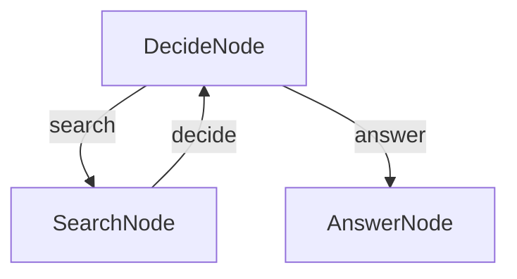

# TypeScript simple agentic ai

### Step for quick testing

```bash
# from BrainyFlow root directory
cd typescript-agent

cp .env.example .env # add your API key

npm install
npm run agent
```

Default question is inside `main.ts`, change it and see the result.

### Feature

- Perform web search
- Gather all infomation from web search
- Answer user question according to search result

### How it work

The flow is comprise of 3 node

1. **DecideNode** is the core of agent flow, it will decide based on context that it can answer the question or not.
2. **SearchNode** is the utility node that if DecideNode decide to perform a search this node will execute.
3. **AnswerNode** if all the context is sufficient for DecideNode to decide to answer the question, this node will execute.

The flow will start with DecideNode and then SearchNode and AnswerNode depending on whether DecideNode decide the action through condition in *post* method ("answer", "search")

Also *post* method in SearchNode will always give the result back to DecideNode through "decide" action to let it decide whether it will search again or give final answer if context is sufficient.

