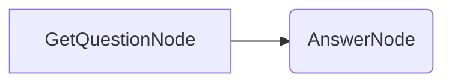

# Getting Started

Welcome to BrainyFlow! This guide will help you get started with the framework.

## 1. Installation

First, make sure you have BrainyFlow installed. Follow the instructions in the [Installation Guide](./installation.md).

## 2. Core Concepts

BrainyFlow uses a simple yet powerful abstraction based on a **Graph + Shared Store**:

- **[Node](./core_abstraction/node.md)**: Represents a single unit of work, often involving an LLM call or data processing.
- **[Flow](./core_abstraction/flow.md)**: Connects Nodes together to define the sequence of operations.
- **[Shared Store](./core_abstraction/communication.md)**: A dictionary-like object passed between nodes, allowing them to share data.
- **[Batch](./core_abstraction/batch.md)**: Enables processing multiple data items in parallel or sequentially.

## 3. Your First Flow (Conceptual)

Let's imagine a simple Question-Answering flow:

1.  **GetQuestionNode**: Takes user input.
2.  **AnswerNode**: Uses an LLM to answer the question based on the input.

This flow would involve:

- `GetQuestionNode` writing the user's question to the `shared` store.
- `AnswerNode` reading the question from the `shared` store, calling an LLM utility, and writing the answer back to the `shared` store.

## 4. Agentic Coding

BrainyFlow is designed for **Agentic Coding**, where humans focus on high-level design and AI agents handle the implementation details.

Before diving into complex code, review the [Agentic Coding Guide](./agentic_coding.md) to understand the recommended development process. This involves:

1.  Defining Requirements
2.  Designing the Flow (using diagrams like the one above)
3.  Identifying and implementing necessary Utility Functions (like an LLM wrapper)
4.  Designing Node interactions with the Shared Store
5.  Implementing the Nodes and Flow
6.  Optimizing the prompts and flow
7.  Ensuring Reliability with testing and error handling

## 5. Explore Design Patterns and Utilities

BrainyFlow supports various [Design Patterns](./design_pattern/index.md) like Agents, RAG, and MapReduce. Explore these patterns to build more sophisticated applications.

While BrainyFlow doesn't include built-in utilities, check the [Utility Function](./utility_function/index.md) examples for guidance on implementing common functionalities like LLM wrappers, web search, and vector database interactions.

## Next Steps

- Dive deeper into the [Core Abstraction](./core_abstraction/index.md) documentation.
- Explore the [Design Patterns](./design_pattern/index.md) to see how BrainyFlow can be applied.
- Start building your first application following the [Agentic Coding Guide](./agentic_coding.md).
